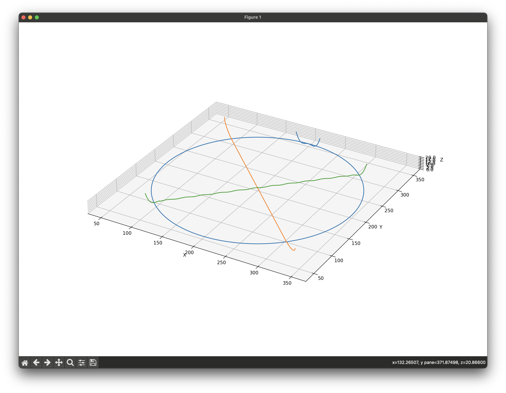

# PlotPaint

A library for painting with a plotter — originally a Python package,
now ported to JavaScript using Vite and Three.js.

See `src/main.js` (browser demo) or `scripts/export-gcode.js` (Node
headless export) for usage examples.



## Getting started

```
npm install
npm run dev       # run the browser demo with hot reload
npm run build     # build to dist/
npm run export    # run the example in Node and write painting.gcode
```

## Project layout

- `src/plotpaint/` — the library
  - `plotpaint.js` — the main `Plotpaint` class
  - `npline.js` — line / polygon utilities (interpolate, offset, rotate, …)
  - `draw.js` — drawing helpers (`poly`, `line`, `concfill`, `contractexpand`)
  - `easing.js` — easing curves (drop-in replacement for `easywaves.npCurves`)
  - `simplify.js` — 3D Ramer-Douglas-Peucker (drop-in replacement for `simplify5d`)
- `src/viz.js` — Three.js 3D visualisation (replaces the matplotlib viz)
- `src/main.js` — browser demo entry point
- `scripts/export-gcode.js` — Node-only gcode export

## Notes on the port

- `numpy` was replaced with plain JS arrays. Helpers like `linspace`,
  `cumsum` etc. are inlined where used.
- `shapely.Polygon.buffer` (used by `contractexpand` and `concfill`) is
  approximated with `npline.offset`. This is adequate for convex / mildly
  concave polygons; complex concave cases are not handled.
- The `viz()` method renders with Three.js + OrbitControls rather than
  matplotlib.
- The `output()` method returns `{ filename, text }` so the caller can
  decide how to persist — the browser demo offers a download button,
  the Node script writes to disk directly.
